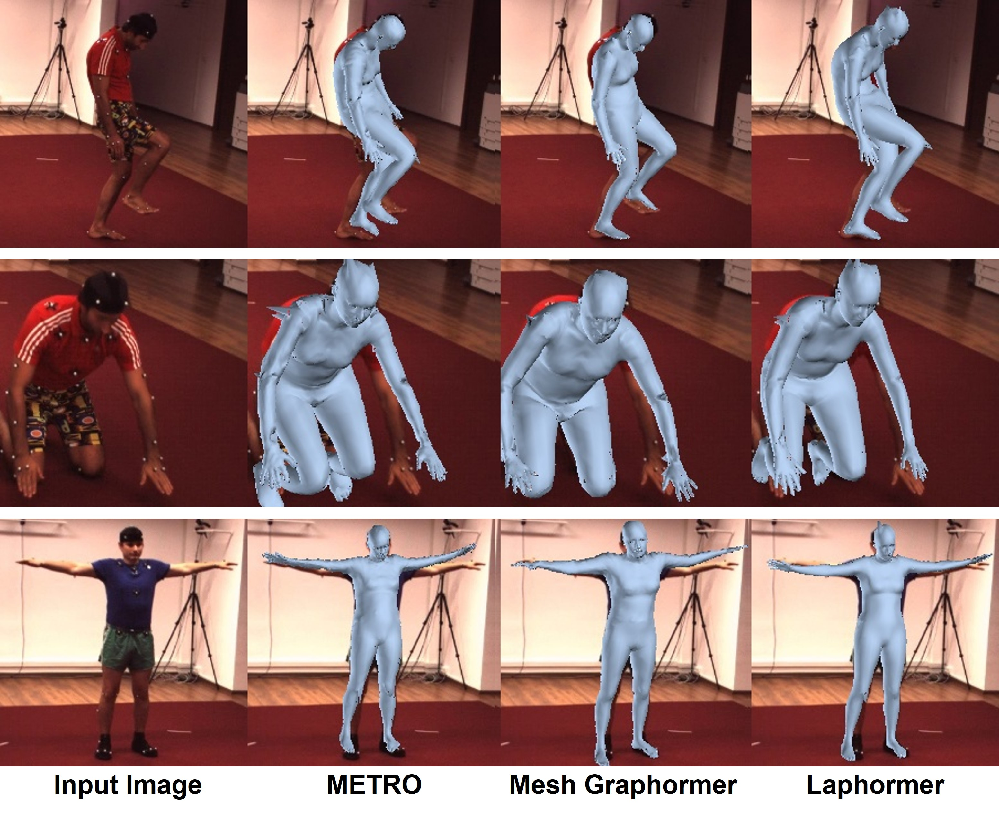
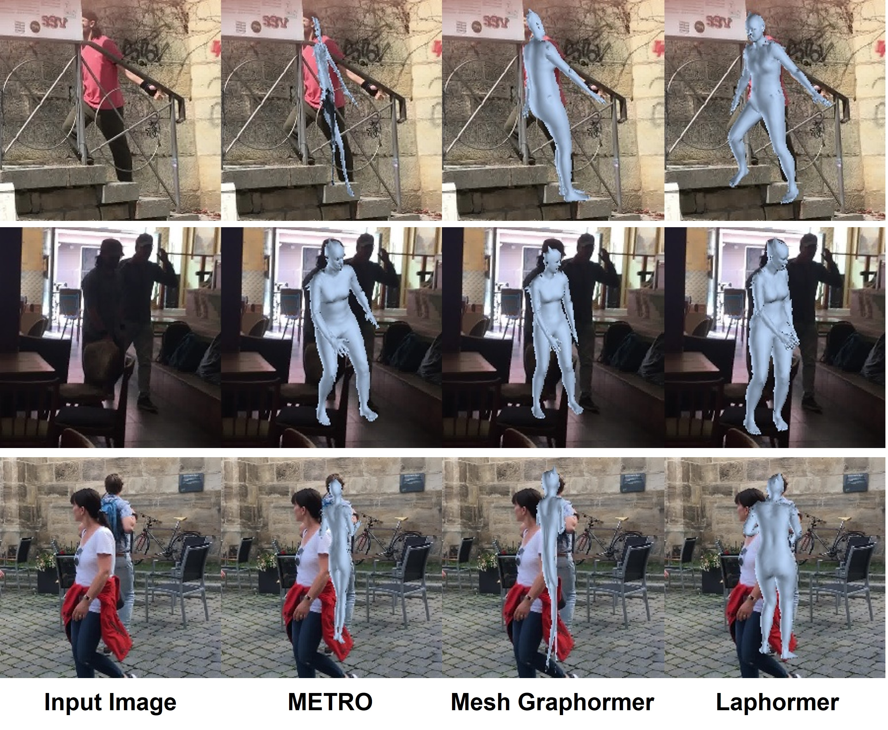

# Laphormer_release

#### (The codes will be uploaded after the submitted paper is accepted)

Laplacian Decomposition-based Transformer for 3D Human Pose Estimation

### Results of 3D human modeling on Human3.6M. From left to right: input images, METRO results, Mesh Graphormer results, and Laphormer results (ours). 

### Results of 3D human modeling on 3DPW. From left to right: input images, METRO results, Mesh Graphormer results, and Laphormer results (ours). 

